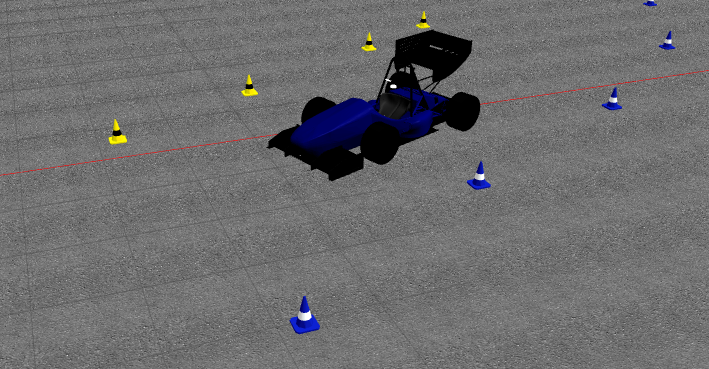

# UKF Localisation of a Formula Student Car

This contains a Gazebo simulation of the car of the KTH Formula Student team, and the implementation of an Unscented Kalman Filter estimating the pose and the twist of the car.



The Gazebo simulation is highly based on the code of the Formula Student team of Edinburgh
(sources on GitHub: https://github.com/eufsa/eufs_sim).

## Install

Working with Ubuntu 16.04 and ROS Kinetic. Required packages:
* ros-kinetic-ackermann-msgs
* ros-kinetic-twist-mux
* ros-kinetic-joy
* ros-kinetic-controller-manager
* ros-kinetic-robotnik-msgs
* ros-kinetic-velodyne-simulator
* ros-kinetic-effort-controllers
* ros-kinetic-velocity-controllers
* ros-kinetic-joint-state-controller
* ros-kinetic-gazebo-ros-control
* ros-kinetic-teleop-twist-keyboard
* ros-kinetic-hector-gazebo-plugins
* python-catkin-tools
* python-numpy
* python-scipy


```
sudo apt-get install ros-kinetic-ackermann-msgs ros-kinetic-twist-mux ros-kinetic-joy ros-kinetic-controller-manager ros-kinetic-robotnik-msgs ros-kinetic-velodyne-simulator ros-kinetic-effort-controllers ros-kinetic-velocity-controllers ros-kinetic-joint-state-controller ros-kinetic-gazebo-ros-control ros-kinetic-robotnik-msgs ros-kinetic-teleop-twist-keyboard ros-kinetic-hector-gazebo-plugins python-catkin-tools python-numpy python-scipy
```

```
cd
mkdir -p project_ws/src
cd project_ws/src
git clone https://github.com/CorentinChauvin/ukf-localisation.git
catkin build
```

## Run the project
- To launch the simulation: `roslaunch eufs_gazebo small_track.launch`
- To control the car: `roslaunch robot_control keyboard_robot_control.launch`
- To launch the UKF: `git add ukf_localisation/src/ukf_localisation.py`

## Tuning
- The parameters for the simulation can be found in `gazebo_simulation/eufs_gazebo/config/simulation.yaml`
- The parameters for the UKF can be found in `ukf_localisation/config/ukf.yaml`

## TODO
- Investigate offsets in noised odometry position
- Dynamic reconfiguration of the parameters

## Changelog
- 2019.01.04:
  - UKF cones update working
- 2019.01.03:
  - UKF odometry update working
  - UKF GNSS update working
- 2018.12.27:
  - UKF prediction phase working
- 2018.12.10:
  - Add working Gazebo simulation
